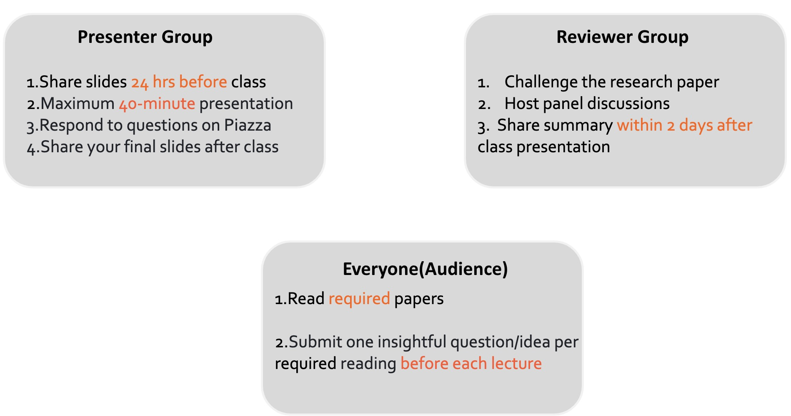

</img>

# Topics in LLM Agents(25'Spring)
## Course Console
**Lectures**: Room 1304 | Siebel Center for Comp Sci , Tuesday/Thursday 03:30 PM - 04:45 PM.
| Member (NetID) | Role | Office Hours |
| :---------------- | :--- | :----------- |
| [Jiaxuan You](https://cs.stanford.edu/~jiaxuan/) (jiaxuan) | Instructor | 
| [Jinwei Yao](https://kivi-yao.github.io/) (jinweiy) | TA | 

**Canvas**: for homework/report submission.

**Github**: most of course information is here, including schedule and paper lists.

**Piazza**:  *ALL* communication regarding this course must be via [Piazza](https://piazza.com/illinois/spring2025/cs598jy2). This includes questions, discussions, announcements, as well as private messages.

**OpenReview**: for the simulation of review and response as part of the course  projects.

**Note:** Please use [Piazza](https://piazza.com/illinois/spring2025/cs598jy2) to submit your questions. Please **DON'T** email the TA or Professor You, unless the matter is private.
## Course Description
**Learning Objectives**: This course offers an in-depth exploration of the fascinating field of LLM agents. Designed as a seminar-style course, it guides students through the fundamental methods that power LLM agents and examines their practical applications in real-world contexts. At the end of this course, you will be able to:
- Have a great overview of state-of-the-art LLM agent papers;
- Familiar with the process of research lifecycle including paper submission, paper review and rebuttal;
- Critique and evaluate the design details of LLM agent papers.

**Structure**: The course is structured around reading cutting-edge research papers, student-led presentations, interactive discussions, and collaborative semester-long projects. We begin with an introduction to the core concepts of LLM agents, then delve into the latest research on building agents, covering topics including:  
- Agent ability
  - Reasoning
  -  Memory
  -  Planning
  -  Multimodal understanding
- Agent evaluation
- Agent framework
  - Tool use
  - Retrieval-augmented generation
  - Multi-agent systems
- Agent application
  - Auto-research
  - Coding agents
  - Social agents
  - Gaming agents
- Challenges from agents to AGI
  - Data
  - Safety
  - Human-agent interaction
  - Alignment

## Tentative Schedule and Reading List
*Note: (1) This is an evolving list; (2) For each topic, there would be 2-3 "required" papers that presenter should include in their in-class presentation.*

| Date    | Readings                                                                                                             | Pilot-Presenter                               | Copilot-Reviewers                           | Notes                                   |
| ------- | -------------------------------------------------------------------------------------------------------------------- | --------------------------------------- | ------------------------------------- | ------------------------------------------- |
|         |  **Course Introduction** |              |	|
| Jan 21  | (Required) Section 1 of [How far are we from AGI?](https://openreview.net/pdf?id=H2ZKqfNd0U)   (Required) [How to Write a Paper](https://cs.stanford.edu/people/widom/paper-writing.html)  (Required) [Language Agents: Foundations, Prospects, and Risks](https://language-agent-tutorial.github.io/slides/I-Introduction.pdf)  [How to Give a Bad Talk](http://www.cs.berkeley.edu/~pattrsn/talks/BadTalk.pdf) | [Jiaxuan]()        |                                       |                                           |
|         |  **Overview of LLM Agents** |              |	|
| Jan 23  | [AI Agent Overview I]  (Required) Section 2-3 of [How far are we from AGI?](https://openreview.net/pdf?id=H2ZKqfNd0U) | [Jiaxuan]() |                                       |                                           |
| Jan 28  | [AI Agent Overview II]  (Required) Section 4-5 of [How far are we from AGI?](https://openreview.net/pdf?id=H2ZKqfNd0U) | [Jiaxuan]() |                                       |                                           |
| Jan 30  | [AI Agent Overview III]  (Required) Section 6-7 of [How far are we from AGI?](https://openreview.net/pdf?id=H2ZKqfNd0U) | [Jiaxuan]() |                                       |                                           |
| Feb 4  | **No Lecture / Work on Project Proposal** |  |
| Feb 6  | **No Lecture / Work on Project Proposal** |  |
|         |  **Agent Ability** |              |	|
| Feb 11  | [Reasoning]  (Required) [Tree of Thoughts: Deliberate Problem Solving with Large Language Models]( https://arxiv.org/abs/2305.10601) (Required) [ReAct: Synergizing Reasoning and Acting in Language Models](https://arxiv.org/abs/2210.03629)  [Chain-of-Thought Prompting Elicits Reasoning in Large Language Models](https://arxiv.org/abs/2201.11903) [LLM Reasoners: New Evaluation, Library, and Analysis of Step-by-Step Reasoning with Large Language Models](https://arxiv.org/abs/2404.05221) |  |
| Feb 13   | [Memory] (Required) [HippoRAG: Neurobiologically Inspired Long-Term Memory for Large Language Models](https://arxiv.org/abs/2405.14831) (Required) [Cognitive Architectures for Language Agents](https://arxiv.org/abs/2309.02427) [Fine-Tuning and Prompt Optimization: Two Great Steps that Work Better Together](https://arxiv.org/abs/2407.10930)    [Global workspace theory of consciousness: Toward a cognitive Global workspace theory of consciousness: Toward a cognitive neuroscience of human experience?](https://digitalcommons.memphis.edu/cgi/viewcontent.cgi?article=1111&context=ccrg_papers) |           |           |          |
| Feb 18   | [Planning] (Required) [LLM+P: Empowering Large Language Models with Optimal Planning Proficiency](https://arxiv.org/abs/2304.11477) (Required) [Language Agent Tree Search Unifies Reasoning Acting and Planning in Language Models](https://arxiv.org/abs/2310.04406) [TravelPlanner: A Benchmark for Real-World Planning with Language Agents](https://arxiv.org/abs/2402.01622) |           |           |          |
| Feb 20   | [Multi-modal Understanding] (Required) [Eyes Wide Shut? Exploring the Visual Shortcomings of Multimodal LLMs](https://arxiv.org/abs/2401.06209) (Required)[VisualWebArena: Evaluating Multimodal Agents on Realistic Visually Grounded Web Tasks](https://arxiv.org/html/2401.13649v2)  [GroundingGPT: Language Enhanced Multi-modal Grounding Model](https://arxiv.org/abs/2401.06071) |           |           |          |
|          | **Agent Evaluation**                                                                                         |           |           |          |
| Feb 25   | [via benchmarks/LLMs/VLMs] (Required) [Autonomous Evaluation and Refinement of Digital Agents](https://arxiv.org/abs/2404.06474) (Required) [Chatbot Arena: An Open Platform for Evaluating LLMs by Human Preference](https://arxiv.org/abs/2403.04132) [AI Agents That Matter](https://arxiv.org/pdf/2407.01502) |           |           |          |
|          | **Agent Framework**                                                                                          |           |           |          |
| Feb 27   | [Tool Use] (Required) [ToolLLM: Facilitating Large Language Models to Master 16000+ Real-world APIs](https://arxiv.org/abs/2307.16789) (Required) [Gorilla: Large Language Model Connected with Massive APIs](https://openreview.net/forum?id=tBRNC6YemY) [ToolkenGPT: Augmenting Frozen Language Models with Massive Tools via Tool Embeddings](https://arxiv.org/abs/2305.11554)         [What Are Tools Anyway? A Survey from the Language Model Perspective](https://arxiv.org/pdf/2403.15452) |           |           |          |
| March 4  | [Retrieval-Augmented Generation] (Required) [Adaptive-RAG: Learning to Adapt Retrieval-Augmented Large Language Models through Question Complexity](https://arxiv.org/abs/2403.14403) (Required) [Corrective Retrieval-Augmented Generation](https://arxiv.org/pdf/2401.15884) [Self-RAG: Learning to Retrieve, Generate, and Critique through Self-Reflection](https://arxiv.org/pdf/2310.11511) [Retrieval-Augmented Generation for Knowledge-Intensive NLP Tasks](https://arxiv.org/abs/2005.11401) |           |           |          |
| March 6  | **No Lecture / Work on Mid-term Presentation**                                                               |           |           |          |
| March 11 | [Mid-term Presentation]                                                                                      |           |           |          |
| March 13 | [Mid-term Presentation]                                                                                      |           |           |          |
| March 25 | [Multi-agent Systems] (Required) [AutoGen: Enabling Next-Gen LLM Applications via Multi-Agent Conversation Framework](https://huggingface.co/papers/2308.08155) (Required) [CAMEL: Communicative Agents for "Mind" Exploration of Large Language Model Society](https://arxiv.org/abs/2303.17760) [Improving Factuality and Reasoning in Language Models through Multiagent Debate](https://arxiv.org/abs/2305.14325) |           |           |          |
|          | **Agent Application**                                                                                        |           |           |          |
| March 27 | [Auto-research] (Required) [ResearchTown: Simulator of Human Research Community](https://github.com/ulab-uiuc/research-town) (Required) [Can Large Language Models Provide Useful Feedback on Research Papers? A Large-scale Empirical Analysis](https://arxiv.org/pdf/2310.01783) [The AI Scientist: Towards Fully Automated Open-Ended Scientific Discovery](https://arxiv.org/abs/2408.06292) |           |           |          |
| April 1  | [Coding Agents] (Required)[OpenHands: An Open Platform for AI Software Developers as Generalist Agents]() (Required) [If LLM Is the Wizard, Then Code Is the Wand: A Survey on How Code Empowers Large Language Models to Serve as Intelligent Agents](https://arxiv.org/abs/2401.00812) [A Survey on Large Language Models for Code Generation](https://arxiv.org/pdf/2406.00515) [SWE-bench: Can Language Models Resolve Real-World GitHub Issues?](https://arxiv.org/abs/2310.06770) |           |           |          |
| April 3  | [Social Agents] (Required)  [Generative Agents: Interactive Simulacra of Human Behavior](https://arxiv.org/abs/2304.03442) (Required) [SOTOPIA: Interactive Evaluation for Social Intelligence in Language Agents](https://arxiv.org/abs/2310.11667)  [SOTOPIA-π: Interactive Learning of Socially Intelligent Language Agents](https://aclanthology.org/2024.acl-long.698.pdf) |           |           |          |
| April 8  | [Gaming Agents] (Required) [Voyager: An Open-Ended Embodied Agent with Large Language Models](https://voyager.minedojo.org) (Required) [MineDojo: Building Open-Ended Embodied Agents with Internet-Scale Knowledge](https://arxiv.org/abs/2206.08853) [A Survey on Large Language Model-Based Game Agents](https://arxiv.org/pdf/2404.02039) [A Generalist Agent](https://deepmind.google/discover/blog/a-generalist-agent/) |           |           |          |
|          | **Challenges from Agents to AGI**                                                                            |           |           |          |
| April 10 | [Data] (Required) [BAGEL: Bootstrapping Agents by Guiding Exploration with Language](https://arxiv.org/abs/2403.08140) (Required) [SOAR: Autonomous Improvement of Instruction Following Skills via Foundation Models](https://auto-improvement.github.io/) [Latent Action Pretraining from Videos](https://arxiv.org/abs/2410.11758) |           |           |          |
| April 15 | [Safety] (Required) [Universal and Transferable Adversarial Attacks on Aligned Language Models](https://arxiv.org/abs/2307.15043) (Required)[DecodingTrust: A Comprehensive Assessment of Trustworthiness in GPT Models](https://arxiv.org/abs/2306.11698)  [Extracting Training Data from Large Language Models](https://www.usenix.org/conference/usenixsecurity21/presentation/carlini-extracting) [The Emerged Security and Privacy of LLM Agent: A Survey with Case Studies](https://arxiv.org/html/2407.19354v1) |           |           |          |
| April 17 | [Human-Agent Interaction] (Required) [Why Johnny Can’t Prompt: How Non-AI Experts Try (and Fail) to Design LLM Prompts](https://dl.acm.org/doi/10.1145/3544548.3581388) (Required) [AI Chains: Transparent and Controllable Human-AI Interaction by Chaining Large Language Model Prompts](https://arxiv.org/abs/2110.01691) [Evaluating Human-Language Model Interaction](https://arxiv.org/abs/2212.09746) |           |           |          |
| April 22 | [Alignment] (Required) [Training Language Models to Follow Instructions with Human Feedback](https://arxiv.org/abs/2203.02155) (Required) [Direct Preference Optimization: Your Language Model is Secretly a Reward Model](https://arxiv.org/pdf/2305.18290) [Position: A Roadmap to Pluralistic Alignment](https://arxiv.org/pdf/2402.05070) [Aligning AI with Shared Human Values](https://arxiv.org/pdf/2008.02275) |           |           |          |
| April 24 | **No Lecture / Work on Final Presentation** |  |
| April 29 | **No Lecture / Work on Final Presentation** |  |
| May 1 | **Final Presentation** |  |
| May 6 | **Final Presentation** |  |
 ## Tentative Grading

 **Groups**:  All activities of this course, except your own participation :), will be performed in groups of 3 students. You can use [Piazza](https://piazza.com/illinois/spring2025/cs598jy2) to find your team mates online. Form a group of 3 members and [declare your group's membership and paper preferences (with your UIUC email address)](https://docs.google.com/forms/d/e/1FAIpQLSdDTtBOoZyMoQtq8EN0Zef_viHxujb4M3ImwkTtbZC48hOU3w/viewform?usp=header ) by **Jan 30**. After this date, we will form groups from the remaining students.

 | Component                 | Weight | Breakdown                      |
|---------------------------|--------|--------------------------------|
| Pre-class Idea/Question Proposal | 10%   |                                |
| In-class Discussion       | 25%   | - 15% In-class Pilot Presentation - 10% In-class Co-pilot Summary |
| Projects                  | 65%   | - 5% Proposal Report - 5% Midterm Presentation - 30% Final Survey Report - 10% Review and Response - 15% Final Presentation |

## Policies

### Pre-class: Pre-class Idea/Question Proposal
Each lecture will include **one or two required readings** that all students are expected to read. Additionally, there will be *optional related readings* that only the presenter(s) are required to familiarize themselves with. These optional readings are not mandatory for the rest of the class.

Before each lecture, all students must [submit here(with your UIUC email address)](https://docs.google.com/forms/d/e/1FAIpQLSdZV1u6A7WCVBihXsJI5E2AXxwi9IRFgiBJIjNVZaJ1OeBX5g/viewform?usp=header )  **one insightful question/idea** for each of the presented papers.
### In-class: Presentation & Discussion
In each class after **Overview of LLM Agents** taught by Prof.You, the students are expected to conduct the presentation and discussion. 

This discussion will involve two distinct roles played by different **student groups**, simulating an interactive and dynamic scholarly exchange. Each group will be assigned to the following two roles once:
1. **The Pilot Presenter:**
   - **Group Assignment:** Prepare slides for papers marked as "Required" and deliver a presentation on a specific topic.
   - **Responsibility:** Present the assigned topic and address audience questions during the presentation.

2. **The Co-pilot Reviewers:**
   - **Group Assignment:** Write a summary of the paper and take on the role of reviewers for one assigned slot.
   - **Responsibility:** Critically evaluate the paper by posing challenging questions, identifying weaknesses, and suggesting areas for improvement. Your role is to provide constructive feedback and engage in a simulated peer review discussion.

**Rest of the Class:** feel free to actively ask questions and engage in the dialogue.

#### Guidelines for the Pilot Presenter
The course will follow a seminar format, with one group presenting during each class session. Each group will be responsible for presenting *at least one lecture* throughout the semester. Presentations should be **no longer than 50 minutes**, excluding interruptions. However, presenters should anticipate and be prepared to address questions and interruptions during their talk.

During your presentation, you are expected to:
- **Provide a concise background** to introduce and motivate the problem (e.g., referencing prior talks for simplicity).
- **Explain the main idea, approach, and/or key insight** from the required reading (use examples whenever appropriate).
- **Cover technical details** to help the audience grasp the key points without needing to closely read the material (provide a quick overview of evaluations).
- **Highlight differences** between the required reading and related works, including any additional readings.
- **Discuss strengths and weaknesses** of the required reading and suggest potential directions for future research.

Submission of slides:
- **Deadlines:** Slides for the presentation must be submitted to the instructor team via Canvas (in \*.pptx format) at least 24 hours before the scheduled class.
- **Format:** We recommend [this template]()(To add).

#### Guidelines for the Co-pilot Reviewers

Each group will be assigned **roughly two paper summaries** in different topics: one in the Co-pilot * Authors* role and the other in the *Reviewer* role. Although these two roles are different in in-class discussions, the summaries are nearly the same.

Each summary should address the following questions in **2–3 pages** with sufficient detail:
1. **What is the problem being addressed**, and why is it important?
2. **What is the state of related works** in this topic?
3. **What solution is proposed**, and what is the key insight guiding the solution?
4. **What are the drawbacks or limitations** of the proposed solution?
5. **What potential directions** could be explored in future research?

Submission of Paper Summary:
- **Deadline:** Summaries must be uploaded to Canvas (by one member in the group) within 24 hours after the presentation of the corresponding paper. **Late submissions will not be counted.**
- **Format:** We provide [this template](Summaries/template.pdf) for your reference. We suggest that you can use Google Docs to enable in-line comments and suggestions.

Best Practices:
- Allocate enough time to read and understand the assigned paper.
- Discuss the paper as a group to share perspectives and insights.
- Write the summary carefully, ensuring clarity and completeness.
- Incorporate key observations from the class discussion in your final submission.
  
### Project: A Survey on LLM Agents
After team building with 3 members in each group, you are expected to start your term-long project ASAP.

To simulate the whole process of academic research, 
you are supposed to have a proposal, submit a paper, review and response.

For the **proposal**:
  - **Topic:** Select a topic (not too ambitious like "LLM agents" or not too small like "Minecraft gaming agents") related to LLM agents. Of course, you can choose the topic that you play as a presenter but it is not mandatory.
  - **Format:** [Templates adapted from TMLR](https://www.overleaf.com/read/rtnfmvhpdchx#540226), about 2 pages.
  - **Deadlines:** Feb 10, 2025.

We will also have a **midterm presentation** to check your progress:
  - **Scheduled Slots:**  March 11/13, 2025.
  - **Time limit:** To decide.

For **survey paper/report submission(draft)**:
  - **Description:** Not the final version but you should be ready and complete for a submission. Important for review and response afterward.
  -  **Where to submit:** OpenReview and Canvas. Details to update later.
  -  **Format:** [Templates adapted from TMLR](https://www.overleaf.com/read/rtnfmvhpdchx#540226). 
  -  **Page Limitation:** To decide.
  -  **Deadlines:** April 16, 2025.

For **review and response**:
  - **Description:** You are expected to review the survey of other groups and response the reviews for your own paper submission. The duration of both review and response would be 1 week for each.
  - **Where to review and response:** OpenReview and Canvas. Details to update later.
  - **Guidelines**: To update.
  - **Deadlines**: Review: April 23; Response:  April 30.

For **final presentation**:
  - **Description:** you are expected to present your survey paper.
  - **Scheduled Slots:** May 1/6, 2025.   
  - **Time limit:** To decide.

For **final version of survey paper**:
- **Description:** you are expected to submit your final version of survey report.
- **Format:** [Templates adapted from TMLR](https://www.overleaf.com/read/rtnfmvhpdchx#540226).
- **Where to submit:** Canvas.
- **Page Limitation:** To decide.
- **Deadlines**: May 8, 2025.

### Summary of Deadlines
We summarize the deadlines of activities of pre-class, in-class and project here  for your convenience.

| Task                                | Who                | Due Date/Time                     | Notes                                      |
|-------------------------------------|--------------------|------------------------------------|--------------------------------------------|
| **Team Building**               | Everyone           | Jan 30                            | Can use [Piazza](https://piazza.com/illinois/spring2025/cs598jy2) to find teammates.    |
| **Team information submission for Topic Assignment** | Every group        | Jan 30                             |   Declare your group's membership and paper preferences (with your UIUC email address) [here](https://docs.google.com/forms/d/e/1FAIpQLSdDTtBOoZyMoQtq8EN0Zef_viHxujb4M3ImwkTtbZC48hOU3w/viewform?usp=header).         |
| **Project Proposal**                | Every group        | Feb 10                            |  Submit to Canvas.                                          |
| **Pre-class Proposal**             | Everyone           |  before the class         |   Submit an insightful question/idea [here(only UIUC email address)](https://docs.google.com/forms/d/e/1FAIpQLSdZV1u6A7WCVBihXsJI5E2AXxwi9IRFgiBJIjNVZaJ1OeBX5g/viewform?usp=header) for each required paper.                      |
| **In-class Discussion**             | Presenter          | 24 hours before the class         |   Submit slides to Canvas                                          |
|                                     |  "Reviewers" | Within 24 hours after the class  | Submit paper summaries to Canvas                                            |
| **Midterm Presentation**            | Every group        | March 25/27                       |                                            |
| **Survey Report Submission (Draft)**| Every group        | April 16                         |   Submit to both Canvas and OpenReview                                                                      |
| **Review and Response**             | Every group        | April 23 for review, and April 30 for response                        |  April 16-23 for review,  April 24-30   for response                                      |
| **Final Presentation**              | Every group        | May 1/6                           |                                            |
| **Report Camera-ready Revision (Final)** | Every group     | May 8                             |   Submit to Canvas                                         |

### **Acknowledgements**
In course structure design, this course is heavily inspired by other seminar-like courses, particularly [UIUC CS598-GenAI System](https://github.com/fanlai0990/CS598). Acknowledgments to [Prof.Fan Lai](https://fanlai.me/) for  generous sharing of his great course. For course topics and paper lists, we mainly refer to [UC Berkeley CS294/194-196 Large Language Model Agents](https://rdi.berkeley.edu/llm-agents/f24) and [EMNLP 2024 Tutorial:
Language Agents: Foundations, Prospects, and Risks](https://language-agent-tutorial.github.io/). Thanks Haofei Yu, Zirui Chen, Kunlun Zhu and other Ulab members for suggestions.
